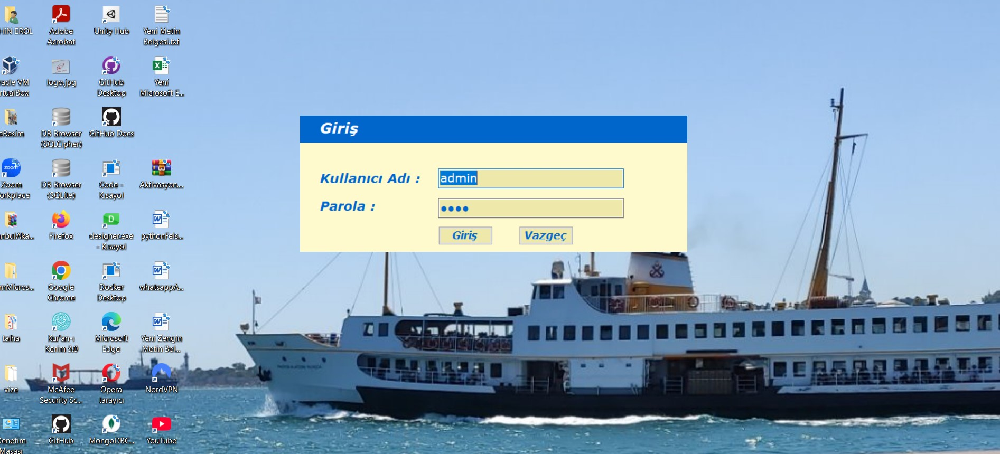
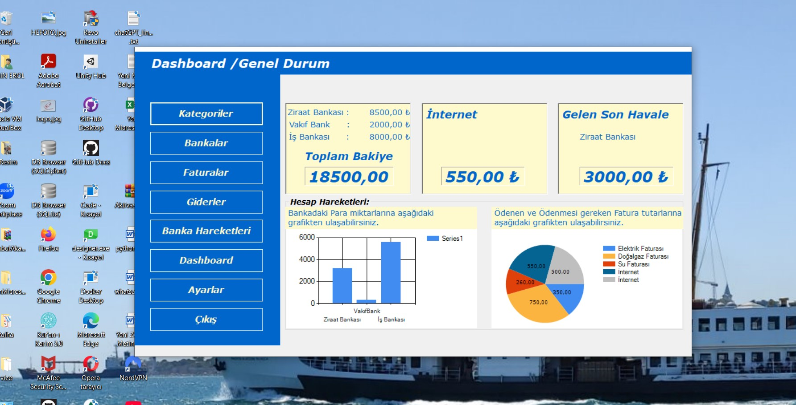
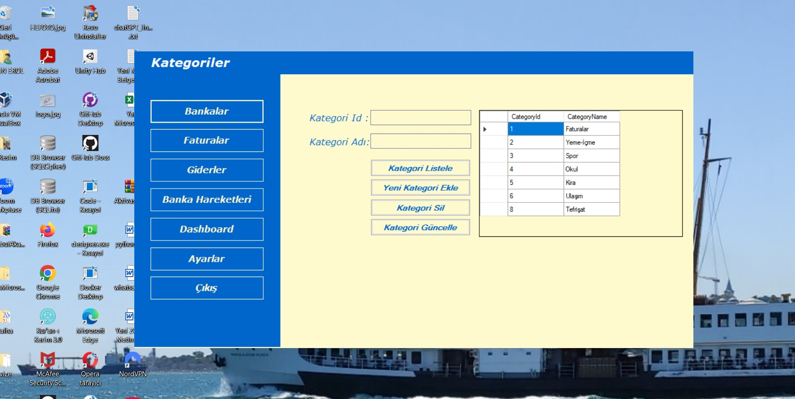
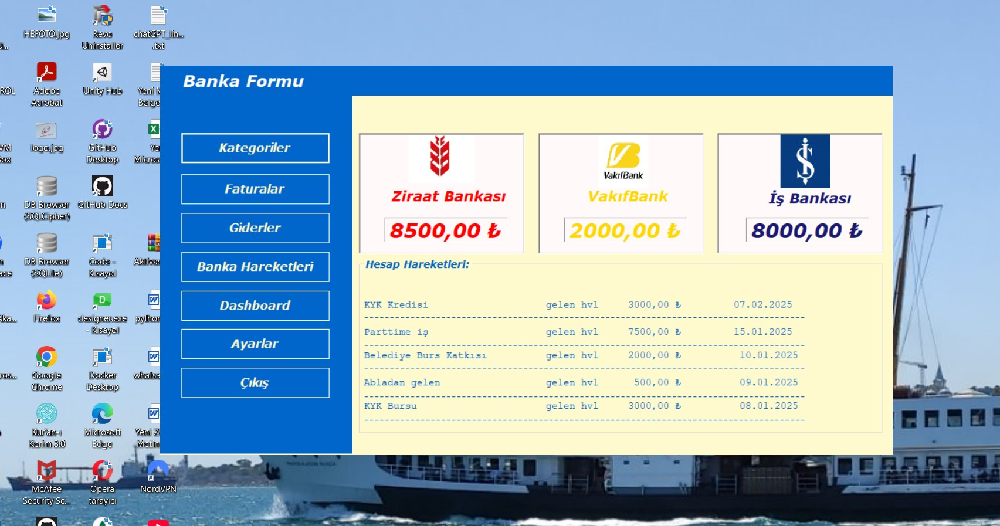
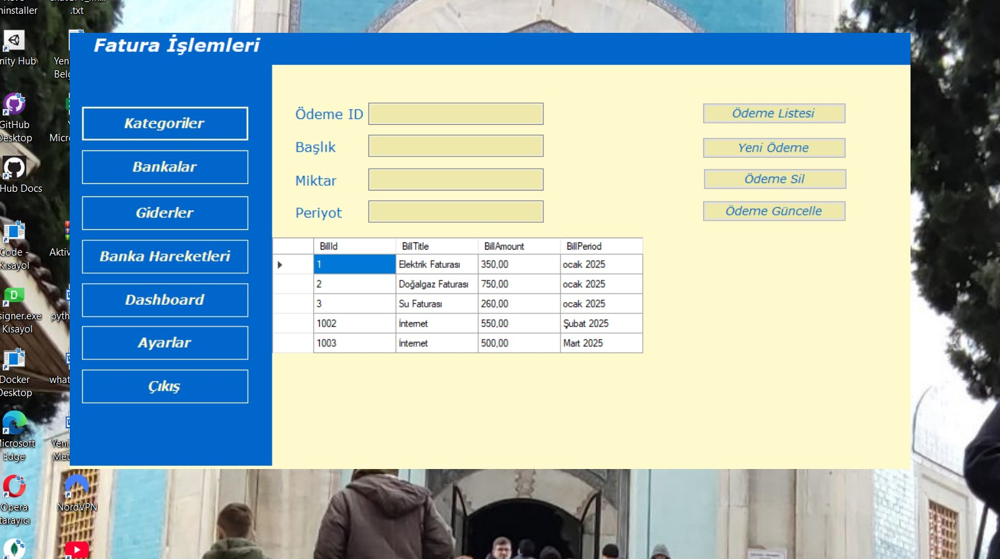
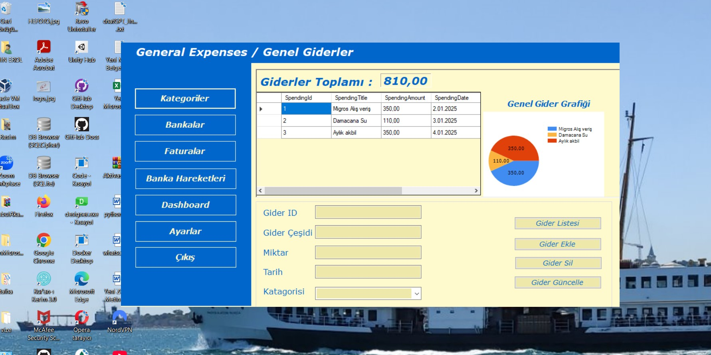
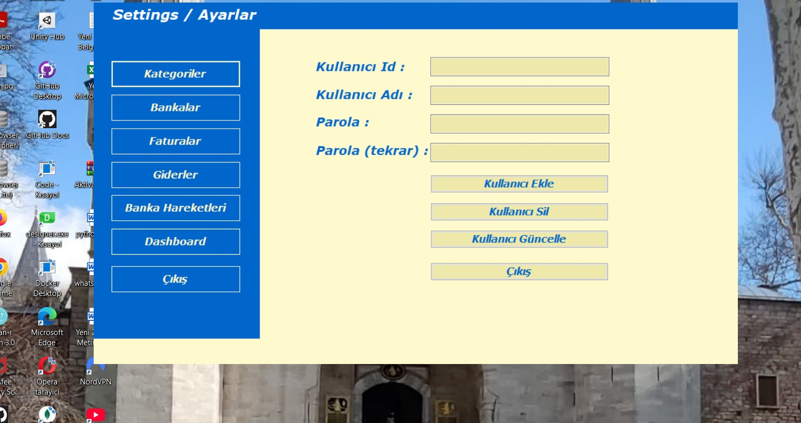

<!DOCTYPE html>
<html lang="tr">
<head>
<body>
    <h1>Murat YÜCEDAĞ ile C# Eğitim Kampı.</h1>
    

        &nbsp;&nbsp;&nbsp;&nbsp;&nbsp;&nbsp;FİNAL PROJEM: FinancialCrm
    
  

  

        
        <strong> GİRİŞ</strong> 
  
 
 
     

   
 
       Giriş Paneli ile proje başlıyoruz. 
       Kullanıcı Ad : admin 
       Parola : 1234
    

    --------------------------------------------  
    

        
        <strong>Dashboard</strong> 
    

    

       Kullanıcı Adı ve Parola default olarak gelmekte Giriş Butonuna tıklayarak 
       Dashboard ekranıyla giriş yapıyorsunuz. 
       Bu ekranda Genel durumun özetini incelebilir butonlar yardımıyla detaylı incelemek için 
       ilgili ekranlara gidebilirsiniz.

--------------------------------------------  

        
        <strong>Kategoriler</strong> 
  
 
 
     

   

   Bu ekranda harcama Kategorleri için; 
   ** Listeleme,  
   ** Kategori Ekleme, 
   ** Kategori Silme ve Kategori bilgilerini Güncelleme işlemlerini yapabilirsiniz.

       

--------------------------------------------  

        
        <strong>Banka Formu</strong> 
  
 
 
     

   

   Bu ekranda Banka bakiyelerin ve oluşan son 5 hesap hareketini görebilirsiniz.
       

--------------------------------------------  

        
        <strong>Fatura İşlemleri</strong> 
  
 
 
     

   

  Bu ekranda Faturalarınız için; 
   ** Listeleme,  
   ** Fatura Ekleme, 
   ** Fatura Silme ve Fatura bilgilerini Güncelleme işlemlerini yapabilirsiniz.
       

--------------------------------------------  

        
        <strong>Genel Giderler</strong> 
  
 

   

  Bu ekranda Genel giderlerinizin bir özetini görebilir, 
  Genel Giderleriniz için; 
   ** Listeleme,  
   ** Genel gider Ekleme, 
   ** Genel gider Silme ve Genel gider bilgilerini Güncelleme işlemlerini yapabilirsiniz.
       

--------------------------------------------  

        
        <strong>Ayarlar</strong> 
  
 
 
     

   

  Bu ekranda Kullanıcılar için; 
   ** Yeni Kullanıcı Ekleme, 
   ** Kullanıcı Silme ve Kullanıcı bilgilerini Güncelleme işlemlerini yapabilirsiniz.
       
       

</body>
</html>
